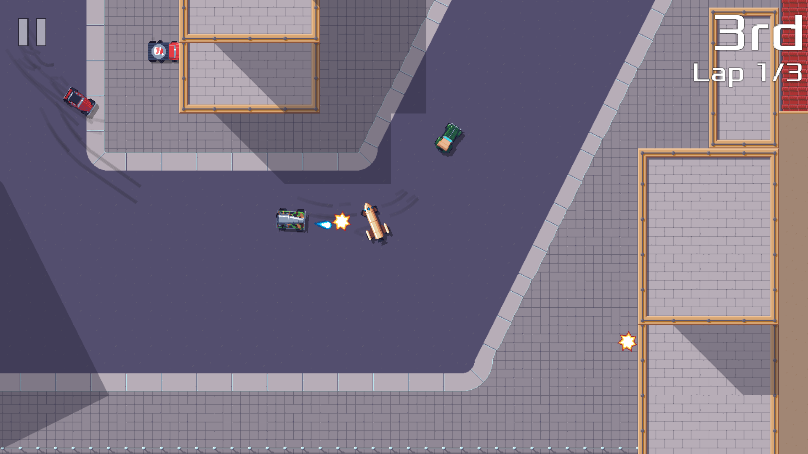

# Pixel Wheels

Pixel Wheels is a retro top-down race game for Linux, macOS, Windows and Android.

It features multiple tracks and vehicles. And various bonus and weapons to help you get to the finish line first!

On PC, you can play Pixel Wheels alone or with a friend.

## I want to try it!

Great! For Linux, macOS and Windows you can get binaries from [Pixel Wheels page on itch.io][itch].

_ARM-based Mac users: Note that Pixel Wheels does not run on ARM-based Macs for now. This will be fixed when [libgdx ARM-based Mac support][libgdx-arm-mac] is ready._

[libgdx-arm-mac]: https://github.com/libgdx/libgdx/issues/6084

For Android you can install Pixel Wheels from [F-Droid][fd] or [Google Play][gplay].

[itch]: http://agateau.itch.io/pixelwheels
[fd]: https://f-droid.org/fr/packages/com.agateau.tinywheels.android/
[gplay]: https://play.google.com/apps/testing/com.agateau.tinywheels.android

### master builds

If you feel adventurous, you can also try binaries from the master branch. These are available from <https://builds.agateau.com/pixelwheels>.

## I think it would be much better if it did X, Y or Z...

I have a reasonably well defined vision of what I want Pixel Wheels to be.  Your feedback and suggestions are welcome, and I will look into it with great attention, but I reserve the right to decide if your ideas fit with the game I am trying to create.

## What if I want to build it myself?

The [build instructions][build] should have you covered.

[build]: docs/building.md

## License

- The game logic is licensed under GPL 3.0 or later. This is all the code in [core/src/com/agateau/pixelwheels](core/src/com/agateau/pixelwheels).
- The rest of the code is licensed under Apache 2.0.
- Assets are licensed under Creative Commons BY-SA 4.0.

The rationale behind these unusual choices is to:

- Allow reuse of all the code and assets by free software projects.
- Allow reuse of utility code in proprietary projects.
- Prevent ad-based, proprietary clones of the game.

Put another way, if you are a game developer and find some of the code interesting, feel free to use it to build your *own* original project. If you are interested in some of the GPL code, get in touch, I am open to relicensing.

On the other hand, if your plan is to take the game, slap some ads on it, and release it without releasing the sources of your changes: the license forbids you to do so, go find another prey.

## Why is the Java package called "tinywheels"?

The game used to be called Tiny Wheels, but I found out there is already a Tiny Wheels game on Steam, so I add to rename it. I did not change the Java package name however because Google Play does not allow changing the package name of an existing app or game.

## Support development of the game

Want to support the development of the game? Awesome! My [support page][support] is waiting for you :)

[support]: https://agateau.com/support/
